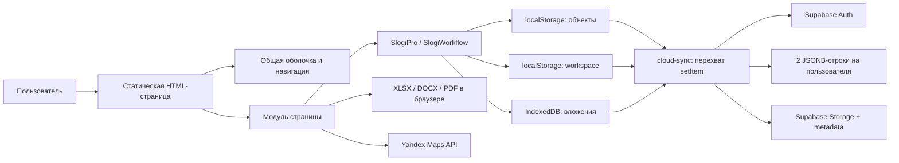
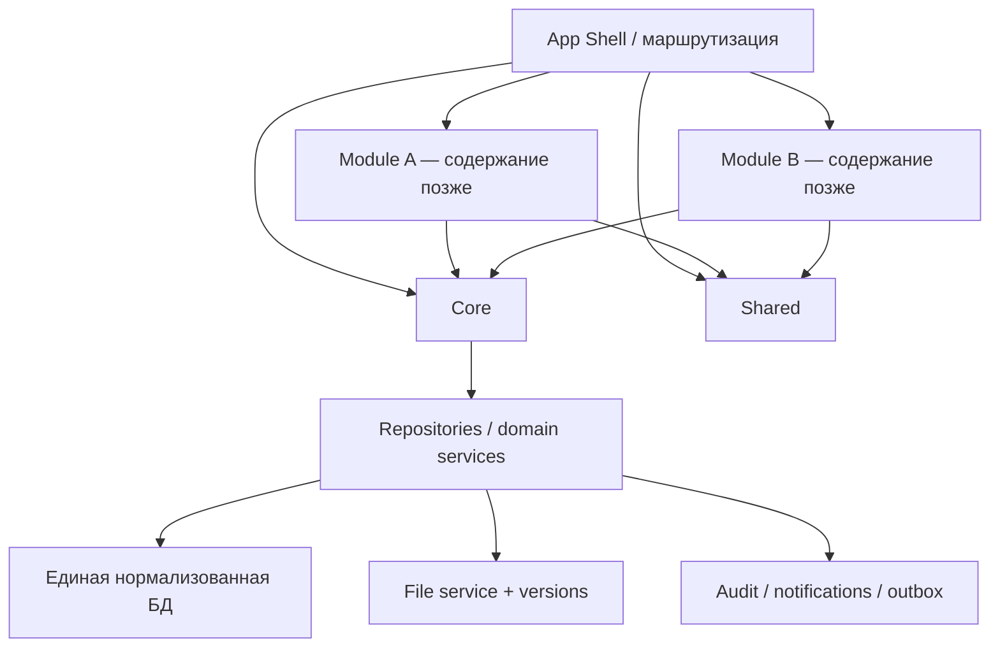

# Комплексный аудит web-платформы «Слоги»

Дата среза: 11 августа 2026 года  
Проект: `SLOGI_objects_alignment_fixed_header`  
Режим работы: только аудит; исходный код и интерфейс не изменялись.

## Область и методика проверки

Проверены все файлы проекта, связи HTML/CSS/JS, локальные и облачные хранилища, SQL-настройка Supabase, авторизация, роли, карта, паспорт объекта, документы, спецификация, смета, КП, финансы, справочники и административные разделы.

В локальном Chromium пройдены сценарии создания и повторного открытия объекта, смены статуса, загрузки и повторного открытия файла, импорта типовой спецификации, формирования и версионирования сметы, выгрузки Excel, формирования и версионирования КП, выгрузки DOCX/PDF, а также desktop/mobile-представления. Для проверки использовался отдельный локальный тестовый объект; производственные данные и внешняя Supabase-база не изменялись.

Ограничения проверки:

- реальный вход в Supabase, смена пароля и профиль авторизованного пользователя не выполнялись без выданной учётной записи;
- межустройственная синхронизация оценена по фактическому алгоритму и SQL, но не проверялась на двух производственных аккаунтах;
- программа подтвердила создание Excel/DOCX и сохранила соответствующие вложения; системное событие скачивания объектных Blob-файлов автоматизированный браузер не перехватил, поэтому финальная кроссбраузерная проверка скачанных файлов остаётся обязательной;
- PDF-выгрузка КП была фактически запущена и завершилась сообщением об ошибке.

---

# A. Краткое резюме

1. Проект — статическое браузерное приложение для GitHub Pages без сборщика, TypeScript, backend-кода, тестов и формальной схемы домена. Основная бизнес-логика находится в глобальных JS-модулях.
2. Базовая локальная цепочка «объект → спецификация → смета → КП» существует и в значительной части работает: объект сохраняется, XLSX распознаётся, смета пересчитывается, версии создаются, Excel и DOCX генерируются.
3. Главный риск потери данных — синхронизация целых JSON-документов. При входе удалённое состояние всегда заменяет локальное без сравнения версий и без слияния. В нескольких вкладках действует правило «последняя запись победила».
4. Импортированные формулы XLSX вычисляются через `Function(...)`. Допустимый набор символов позволяет вызвать браузерные функции, поэтому недоверенный XLSX способен выполнить код в контексте приложения и, в частности, повредить локальные данные.
5. Выход из аккаунта очищает объекты и IndexedDB, но не очищает `slogi_professional_state_v2`: задачи, платежи, документы, команда, подрядчики и журнал могут остаться доступны следующему пользователю браузера.
6. Команда, приглашения и RBAC в текущем виде не являются настоящей многопользовательской системой. Каждому Supabase-пользователю принадлежит отдельная изолированная JSON-строка; «добавить пользователя» создаёт только локальную запись, не аккаунт и не приглашение.
7. Права доступа проверяются главным образом при отрисовке страниц. Неавторизованный пользователь по умолчанию получает роль «Администратор», а ряд изменяющих действий не проверяет `write`-право.
8. Данные одного домена раздвоены: объектный график платежей и глобальные платежи, объектные версии сметы и версии в справочнике, вложения паспорта и глобальные версии документов не имеют единого источника истины.
9. Открытие `passport.html` без `location` немедленно создаёт и сохраняет пустой объект. Отмена и доступное пользователю удаление объекта отсутствуют; корзина реализована в коде, но вход в неё из карточки объекта отсутствует.
10. PDF КП не сформировался в протестированном Chromium. DOCX сформировался; после повторного открытия часть полей формы КП, включая получателя, не восстановилась, хотя текст документа сохранился.
11. Карта кластеров работает, но интерфейс не создаёт и не редактирует координаты объекта. Маркеры появятся только у ранее импортированных объектов с полем `geo`.
12. Часть функций является имитацией: переключатель 2FA, требование причины изменения сроков, добавление участника команды, кнопки настройки некоторых шаблонов. Шаблон проекта кладётся в `sessionStorage`, но паспорт его не читает.
13. Mobile-вёрстка не создаёт общего горизонтального переполнения документа, однако пользователь получает три независимые горизонтальные панели навигации без явного признака прокрутки. Шапка занимает около 166 px, минимальный фактический шрифт в паспорте — 9 px, КП остаётся холстом шириной 794 px.
14. Архитектура пригодна для постепенного рефакторинга, но не для безопасного масштабирования в текущем виде. Переписывание «с нуля» не требуется: нужен поэтапный переход к единому ядру данных, репозиториям, нормализованным таблицам и серверному RBAC.
15. Для будущих Блока 1 и Блока 2 следует сохранить единый аккаунт, организацию, базу объектов, файлы, аудит и UI-kit; назначение блоков до получения требований не определялось.

---

# B. Текущая архитектура

## B1. Инвентаризация

| Категория | Фактическое состояние |
|---|---|
| Клиент | 17 HTML, 19 JS, 7 CSS; JavaScript без модулей, глобальные `window.Slogi*` |
| Сборка | отсутствует `package.json`, bundler, transpiler, lint, unit/e2e test runner |
| Backend в репозитории | отсутствует |
| Хостинг | GitHub Pages, публикация из корня ветки, `.nojekyll` |
| Облачный сервис | Supabase Auth, PostgREST и private Storage через CDN SDK |
| Локальные данные | `localStorage` и IndexedDB |
| Карта | Yandex Maps JS API 2.1; полигоны кластеров из `clusters-data.js` |
| Excel | собственный XLSX parser/generator, pako; SheetJS CDN fallback для не-XLSX |
| Word | ZIP-модификация `KP_Slogi_template.docx` в браузере |
| PDF | SVG `foreignObject` → canvas/JPEG → самописный PDF |
| Конфигурация | URL Supabase, publishable key, production URL и Yandex key захардкожены в JS |
| Переменные окружения | отсутствуют |
| Маршрутизация | отдельные HTML + query parameters `location`, `tab`, `project`, `mine` |
| Кеширование | ручные query-версии `?v=31/33`; документация рекомендует hard refresh |

Крупнейшие модули: `cloud-sync.js` — 1013 строки/61 KB, `professional-pages.js` — 56 KB в 47 длинных строках, `passport-v4.js` — 34 KB, `xlsx-workflow.js` — 410 строк. Несколько JS/CSS-файлов практически минифицированы вручную, что затрудняет review и локальные изменения.

## B2. Поток выполнения

## B3. Фактическое хранение

| Уровень | Ключ/таблица | Содержимое | Гранулярность записи |
|---|---|---|---|
| localStorage | `slogi_locations_v1` | все объекты со вложенными моделями, версиями, графиками | весь массив объектов |
| localStorage | `slogi_professional_state_v2` | команда, задачи, документы, финансы, согласования, справочники, настройки, аудит | весь workspace |
| localStorage | `slogi_active_project_v1` | выбранный объект | одно значение |
| localStorage | `slogi_account_notifications_v1` | личные настройки уведомлений | одно значение |
| sessionStorage | `slogi_project_template` | выбранный шаблон проекта; потребитель отсутствует | одно значение |
| IndexedDB | `slogi_files_v1/attachments` | Blob-вложения, ключ `locationId:type` | один текущий файл на тип |
| Supabase | `slogi_user_state` | копия `locations` JSONB | одна строка на auth user |
| Supabase | `slogi_workspace_state` | копия workspace JSONB | одна строка на auth user |
| Supabase | `slogi_attachments` | metadata файла | `(user_id, location_id, attachment_type)` |
| Storage | `slogi-files` | файл по пути `user/location/type` | один текущий файл на тип |

Сейчас «глобальный workspace» фактически не является общим для команды: RLS разрешает пользователю читать и менять только строки с собственным `user_id`.

## B4. Основные связи и сильная связанность

| Связь | Риск |
|---|---|
| `project` содержит паспорт, спецификацию, смету, КП, график, платежи и версии | любое сохранение переписывает крупный объект; рост размера и конфликтов |
| `professional-core.js` знает объекты, задачи, документы, платежи, роли, аудит | единая точка изменения почти всех глобальных разделов |
| `professional-shell.js` читает роли, объекты, уведомления, поиск и query params | изменения навигации затрагивают все страницы |
| `cloud-sync.js` подменяет `Storage.prototype.setItem` глобально | скрытый side effect для любых модулей, сложное тестирование и гонки |
| workflow-модули хранят новые и legacy-поля одновременно | изменение модели требует поддерживать `stage/phase`, `model/estimateModel`, `state/estimateState` |
| CSS построен слоями с большим числом `!important` и повторных media rules | позднее правило легко ломает исправление раннего |
| документы представлены как имена в объекте, Blob-вложения и отдельный реестр версий | одна операция создаёт несколько несвязанных представлений |

---

# C. Карта страниц

## C1. Рабочие страницы

| Страница | Назначение и вход | Действия / результат | Данные и связи | Основные проблемы |
|---|---|---|---|---|
| `index.html` | Портфель, карта, фильтры; все объекты | открыть/создать объект, фильтровать по адресу, кластеру, статусу | читает объекты, задачи, согласования; Yandex + глобальные кластеры | нет ввода координат; «Мои объекты» зависит от несогласованных `managerId/managerName` |
| `passport.html` | Рабочее пространство `?location=id`, вкладки `?tab=` | создать/редактировать объект, статус, этапы, файлы, Gantt, платежи, архив | один большой объект + IndexedDB/Storage + задачи workspace | пустой объект создаётся до сохранения; нет удаления; этап/статус можно обойти вручную |
| `source-specification.html` | Импорт и редактирование исходного XLSX | загрузить/взять шаблон, править строки, сохранить версию, выгрузить XLSX | `sourceSpecificationModel`, `specVersions`, attachment `spec/spec-edited` | небезопасное вычисление формул; версия файла не соответствует версии модели |
| `specification.html` | Смета по объекту | изменить параметры/цены/количество, резерв, сохранить черновик/версию, Excel | `estimateModel/state`, legacy `model/state`, `estimateVersions`, `total` | дублированная модель; глобальные версии смет отдельно; полный объект переписывается |
| `proposal.html` | Редактор двухстраничного КП | подстановка, contenteditable, черновик/версия, DOCX/PDF | `proposalParagraphs`, `proposalHtml`, версии, связь с номером сметы | PDF падает; выбор старой сметы не загружает её данные; получатель/контакты не восстанавливаются |
| `tasks.html` | Kanban задач, `?mine=1`, `?project=id` | создать/редактировать, менять статус | workspace `tasks`, `members`, objects | нет удаления/архива; исполнитель — локальный member, не auth user |
| `documents.html` | Глобальный реестр версий | добавить metadata/file-версию, скачать, создать следующую | `documentVersions` + attachment с уникальным type | workflow создаёт дубли; `?project=` игнорируется; ссылка «Паспорт» открывает скрытую вкладку |
| `approvals.html` | Согласования | создать, редактировать, согласовать, вернуть | `approvals`, `members`, objects, activity | решение доступно без проверки write/approver; нет неизменяемой истории решений |
| `finance.html` | Глобальный платёжный календарь и прогноз | создать/редактировать/оплатить платёж | workspace `payments`, `contracts`, object `total` | не связан с `project.paymentSchedule`; данные объекта не попадают сюда |
| `contractors.html` | Подрядчики, договоры, сравнение предложений | CRUD без delete для карточек, договоров и сравнений | `contractors`, `contracts`, `comparisons`, objects | нет файлов/версий договора, удаления и строгих связей |
| `analytics.html` | Локальные агрегаты и выгрузка backup | сводка, риски/сроки, экспорт JSON | оба JSON-состояния | качество аналитики зависит от раздвоенных платежей/документов; файлы не входят в backup |
| `catalog.html` | Цены, версии смет, шаблоны | создать/редактировать, «использовать» шаблон | `priceCatalog`, глобальные `estimateVersions`, `templates` | каталог не применяется к рабочей смете; шаблон проекта не применяется паспортом |
| `team.html` | Команда и матрица доступа | создать/изменить локального member | `members` в workspace | не создаёт Auth-пользователя и не выдаёт доступ к общей базе |
| `settings.html` | статусы, уведомления, «безопасность», backup, корзина, аудит | настройки, import/export JSON, restore/purge | workspace settings/trash/activity и objects | 2FA/причина сроков не исполняются; корзина недостижима из объекта; import без схемы |

## C2. Redirect-страницы

- `all-locations.html` → `index.html`;
- `measure-index.html` → `index.html`;
- `measure-passport.html` → `passport.html`.

Это legacy-совместимость, но нет автоматизированного теста, подтверждающего сохранение всех параметров при будущей смене маршрутов.

## C3. Основные пользовательские цепочки

### Объект

`index/passport` → немедленное создание записи → ввод → `Сохранить объект` → весь `slogi_locations_v1` → debounce cloud upsert → повторное открытие.

Результат теста: сохранение и повторное открытие прошли; обнаружены преждевременное создание пустого объекта и несинхронное обновление object-context в шапке до следующей перезагрузки.

### Документы

Файл → немедленный cloud/IndexedDB save → имя в объекте только после сохранения паспорта → повторное открытие/скачивание текущего Blob.

Результат теста: файл загрузился и появился после повторного открытия. Удаление отсутствует. Один тип файла заменяет предыдущий. Отдельные глобальные версии используют другой механизм.

### Смета

XLSX → модель спецификации → формулы количества → модель сметы → итог/резерв → версия в объекте + metadata в глобальном реестре → XLSX attachment.

Результат теста: типовой XLSX распознан, спецификация v1 и смета v1 сохранены, итог пересчитан, Excel сформирован. Версионность и глобальный реестр дублируются.

### КП

Текущие данные объекта/смёты → массив параграфов → contenteditable → версия → DOCX template или raster PDF.

Результат теста: версия и DOCX сформированы; PDF завершился ошибкой. Получатель сохранился в тексте, но поле формы после открытия стало пустым.

### Статус

Результат теста: статус «В работе» сохранился и восстановился. Ограничений переходов нет; статус и этап не образуют согласованную state machine.

### Личный кабинет

Проверены формы входа/регистрации/восстановления и код профиля, смены пароля, выхода. Без учётных данных фактический sign-in не выполнялся. Выход содержит дефект неполной очистки workspace.

---

# D. Карта данных

## D1. Сущности

| Сущность | Основные фактические поля | Создание/редактирование | Хранение и зависимости |
|---|---|---|---|
| Auth User | `id`, `email`, `user_metadata.full_name`, `position`, возможные `role/access_level` | Supabase sign-up/profile/password | Supabase Auth; владелец двух JSONB-строк и Storage-папки |
| Member | `id,name,position,role,email,status` | Team modal | workspace JSON; используется задачами/согласованиями; не связан надёжно с Auth |
| Object/Project | `id,address,status,stage,stageChecks,clusterName,managerName,legalEntity,landlord,...,area,floor,dates,contacts,gantt,paymentSchedule,total,...` | Passport | locations JSON; родитель всех объектных моделей |
| Stage/Checklist | `stage`, `stageChecks[stage][index]` | Passport stages | вложено в объект; определения этапов захардкожены в двух JS-файлах |
| Gantt row | `name,start,end` | Passport schedule | `project.gantt` |
| Object payment | `name,planDate,planned,actualDate,actual,status` | Passport finance | `project.paymentSchedule`; не единая сущность с global payment |
| Attachment | `key,locationId,type,name,mime,blob,updatedAt` | Passport/workflows/global documents | IndexedDB и Supabase metadata/Storage; ключ определяет возможность версий |
| Source specification | `params[{address,label,value}]`, `categories[].subs[].items[{num,group,name,price,qty_expr,manual_cost}]` | XLSX import/editor | `project.sourceSpecificationModel` |
| Specification version | `version,createdAt,name,model` | Save specification | `project.specVersions`, максимум 8 metadata/model snapshots |
| Estimate | `estimateModel,estimateState,total,estimateReserve,estimateUpdatedAt,outdated` + aliases `model/state` | Estimate editor | вложено в object; зависит от specification |
| Object estimate version | `version,createdAt,sourceSpecVersion,total,model,state` | Create version | `project.estimateVersions`, максимум 8 |
| Global estimate version | `projectId,version,scenario,status,reserve,baseTotal,note,authorId` | Catalog | workspace `estimateVersions`; не синхронизирована с object versions |
| Proposal | `proposalParagraphs,proposalHtml,proposalEstimateVersion,desiredRate,leaseYears,rentHolidays,floorEntrance,signatory,signatoryPosition` | Proposal editor | вложено в object; зависит от estimate version number |
| Proposal version | `version,createdAt,estimateVersion,paragraphs` | Create version | `project.proposalVersions`, максимум 8 |
| Document version | `id,projectId,type,name,version,status,authorId,comment,attachmentType,fileName,createdAt,updatedAt` | Global documents и workflow side effect | workspace JSON + необязательный Blob |
| Task | `id,title,projectId,ownerId,dueDate,priority,status,stage,description` | Tasks | workspace JSON |
| Approval | `id,projectId,entityType,title,version,approverId,dueDate,status,comment,decisionAt` | Approvals | workspace JSON |
| Global payment | `id,projectId,category,title,amount,plannedDate,vendorId,status,contractNumber,invoiceNumber,paidDate` | Finance | workspace JSON |
| Contractor | `id,name,inn,speciality,contact,communication,rating,status,comment` | Contractors | workspace JSON |
| Contract | `id,projectId,contractorId,number,amount,startDate,endDate,status,subject` | Contractors | workspace JSON |
| Comparison | `id,title,offers[{contractorId,price,days}],winnerId,comment,status` | Contractors | workspace JSON |
| Price item | `id,code,category,name,unit,price,supplier,region,status,note` | Catalog | workspace JSON; не участвует в рабочем расчёте |
| Template | `id,type,name,description,status` | Catalog | workspace JSON/sessionStorage; проектный маршрут не применяется |
| Settings | statuses, notifications, `staleDays`, `defaultReserve`, `twoFactor`, `requireChangeReason` | Settings | workspace JSON; часть полей декларативна |
| Activity | `id,projectId,type,text,actorId,actorName,createdAt,meta` | side effect | workspace JSON, максимум 500, изменяем пользователем/import |
| Notification | `id,title,text,link,level,read,createdAt` | side effect/shell | workspace JSON, максимум 100 |
| Trash project | копия объекта + `deletedAt` | API `softDeleteProject`, restore/purge Settings | workspace JSON; доступного вызова soft-delete из UI нет |

## D2. Дублирование данных

| Дублирование | Последствие |
|---|---|
| `stage` и legacy `phase`; `stageChecks` и `phaseChecks` | риск рассинхронизации и разное число этапов (6 против legacy 5) |
| `estimateModel/state` и `model/state` | почти двойной объём каждого текущего расчёта |
| object `estimateVersions` и workspace `estimateVersions` | две разные истории с разными полями и экранами |
| `paymentSchedule` и workspace `payments` | паспорт и глобальные финансы показывают разную правду |
| object doc names, attachments, object version arrays и `documentVersions` | дубли, неверная комплектность, неполное удаление |
| этапы в `passport-v4.js` и `professional-shell.js` | изменение названий/числа этапов надо повторять |
| статусы в defaults, fallback паспорта и Settings | поведение зависит от того, какой источник прочитан |
| `clusters-data.js` и отдельный `clusters.geojson` | две копии геоданных; runtime использует JS-копию |
| `app-shell.css` содержит несколько последовательных поколений правил v2/v20/v30 | каскад и `!important` скрывают фактический источник стиля |

## D3. Повторный ввод

- `managerName` вводится текстом, хотя существует справочник members; `managerId` почти никогда не устанавливается.
- подрядчик/договор/счёт вводятся в глобальных финансах отдельно от object payment schedule.
- получатель и контакты КП повторно вводятся после открытия, если они не были сохранены в соответствующих полях паспорта.
- версии сметы приходится отдельно фиксировать в рабочем редакторе и в каталоге сценариев.
- данные документов могут повторно вводиться в паспорте и глобальном реестре.

---

# E. Найденные проблемы

## CRITICAL

| ID | Проблема | Доказательство и риск | Рекомендация |
|---|---|---|---|
| C-01 | Выполнение формул XLSX через динамический код | `xlsx-workflow.js:282-293` строит `Function(...)`. Whitelist разрешает имена, точки и вызовы; недоверенный файл способен вызвать браузерные API и повредить данные | заменить на настоящий parser выражений с AST и whitelist операций/`ROUND`; никогда не исполнять строку |
| C-02 | Потеря локальных изменений при cloud sync | `cloud-sync.js:718-723` всегда делает remote authoritative, хотя получает `updated_at`; workspace аналогично. Нет merge, revision, ETag или optimistic lock | ввести revision/version, compare-and-swap, conflict UI и очередь offline mutations; синхронизировать сущности, не blob |
| C-03 | Конфиденциальные workspace-данные остаются после выхода | `signOutSafely()` очищает locations и IndexedDB, но не `slogi_professional_state_v2`; приложение работает без входа и default role — Admin | при выходе атомарно очищать все user-scoped keys/DB/cache; до очистки проверять успешный upload; тест «пользователь A → выход → B» |
| C-04 | RBAC и команда не являются реальной границей безопасности | роли применяются на клиенте, default — Admin; user metadata считается источником роли; action-level проверки неполны; RLS даёт только личные, а не общие данные | организации + memberships + server-owned roles + RLS policies по membership; запрет self-elevation; backend/RPC для решений и приглашений |

## HIGH

| ID | Проблема | Влияние |
|---|---|---|
| H-01 | `passport.html` сразу сохраняет пустой объект | мусорные объекты при отмене/случайном переходе; доступного удаления нет |
| H-02 | Whole-blob и multi-tab last-write-wins | параллельные вкладки/устройства перезаписывают задачи, объекты и настройки целиком |
| H-03 | Workflow-страницы не слушают `cloud-ready/locations-updated` | поздняя синхронизация оставляет в памяти устаревший объект; последующее Save может вернуть старые данные в облако |
| H-04 | Два финансовых контура | объектный график существует отдельно от global payments; глобальная страница показала пустой календарь при наличии строки в объекте |
| H-05 | Три контура версий документов/смет | одна версия и её выгрузка создают две строки v1; global estimate scenarios не связаны с рабочими snapshots |
| H-06 | PDF КП не работает в протестированном Chromium | ключевая заявленная выгрузка фактически завершилась ошибкой |
| H-07 | Выбор старой версии сметы в КП не загружает snapshot | меняется только номер связи/подпись; содержание и итоги остаются текущими, что может породить неверный документ |
| H-08 | Поля КП восстанавливаются не полностью | получатель и ручные контакты теряются из формы; повторное «Обновить данные» может заменить сохранённый текст placeholder-значениями |
| H-09 | Файлы нельзя удалить, workflow-файл перезаписывается | нет сценария удаления; замена уничтожает текущий файл по тому же type; версии модели не равны версиям файлов |
| H-10 | Удаление проекта фактически недоступно | `softDeleteProject` нигде не вызывается из UI; purge не удаляет связанные workspace-записи и локальные/облачные файлы |
| H-11 | Публичные/неподтверждённые функции безопасности | 2FA и требование причины изменения сроков только сохраняют checkbox; контроля нет |
| H-12 | «Добавить пользователя» и проектные шаблоны — имитация | member не получает аккаунт; `slogi_project_template` паспорт не читает; кнопки Settings «Настроить» без handlers |
| H-13 | Этапы и статус можно обойти | select позволяет сразу сохранить любой этап/статус независимо от checklist и обязательных документов |
| H-14 | Карта не умеет назначать координаты объекту | адрес не геокодируется, поля `geo` нет; большинство новых объектов не получит marker |
| H-15 | Ошибка контекстной навигации документов | ссылка `#docs-grid` открывает default overview, а `documents.html?project=` не применяет фильтр |
| H-16 | Риск переполнения localStorage | полные модели и до 8 deep-copy версий хранятся внутри объекта, текущая смета дублируется; QuotaExceeded не обрабатывается как recoverable error |
| H-17 | Последовательная загрузка всех attachment types | паспорт выполняет до 20 последовательных metadata/download запросов; latency растёт линейно |

## MEDIUM

| ID | Проблема | Влияние |
|---|---|---|
| M-01 | Нет типов, модулей, тестов и CI | рефакторинг не защищён контрактами и regression suite |
| M-02 | UI и бизнес-логика смешаны в строках HTML | трудно переиспользовать, тестировать и разделять на блоки |
| M-03 | Нет формальной миграции схемы | `version=3` просто проставляется normalize-функцией; преобразования данных не документированы |
| M-04 | Backup неполный | JSON не содержит Blob-файлы, Supabase Auth и полноценную ссылочную целостность |
| M-05 | Import backup почти не валидируется | произвольная структура заменяет locations/workspace; нет dry run, версии схемы, rollback |
| M-06 | Аудит изменяем и неполон | журнал находится в том же JSON, импортируется/перезаписывается, не является доказательным audit trail |
| M-07 | Автор документа некорректен | часть записей имеет hardcoded `member-maria`, workflow-записи — без authorId; UI показал «Не назначен» |
| M-08 | Ряд сущностей не имеет lifecycle/delete | задачи, согласования, платежи, contractors, contracts, catalog records накапливаются без архива/удаления |
| M-09 | Метрики комплектности расходятся | паспорт считает весь перечень этапных результатов, global meta — только План/Спецификация/Смета/КП |
| M-10 | Нет CSP/SRI, зависимости грузятся с CDN | supply-chain и XSS blast radius выше; SheetJS имеет три runtime fallback URL |
| M-11 | Ручное cache busting | несколько версий `v31/v33`, нет asset manifest/deploy hash; документация требует hard refresh |
| M-12 | Ошибки скрываются общими сообщениями | cloud file read возвращает `null`, генераторы часто показывают «не удалось» без технического кода/повторной попытки |
| M-13 | Мобильная навигация перегружена | 166 px header, три скрыто прокручиваемые полосы; нет заявленного в publish guide мобильного меню |
| M-14 | КП на мобильном — 794 px canvas | горизонтальное редактирование; до preview нужно пройти sidebar высотой около 1357 px |
| M-15 | Таблицы требуют 760–900 px | предусмотрен scroll, но нет card mode, sticky first column или явной подсказки о горизонтальном жесте |
| M-16 | Accessibility | множество inputs без accessible name, 9–10 px тексты, modal без focus trap/return, icon-only `×`, скрытые scrollbars |
| M-17 | CSS patch accretion | повторные media rules и `!important` делают результат зависимым от порядка |
| M-18 | Глобальный поиск неполон | не ищет approvals/payments/contracts/settings; документный результат теряет фильтр |

## LOW

| ID | Проблема |
|---|---|
| L-01 | в шаблоне КП опечатка «лети развивают» |
| L-02 | пункты преимуществ визуально получают двойное тире |
| L-03 | одинаковые действия названы «Сформировать», «Редактировать», «Новая версия», «Сохранить черновик» без единой терминологии |
| L-04 | адрес и названия обрезаются в компактной шапке без простого способа увидеть полный текст |
| L-05 | часть визуальных статусов выражена только цветом/символом |

---

# F. Дублирование

## F1. Повторяющийся код

- форматирование денег, дат, HTML escaping и UUID реализованы в нескольких файлах;
- stage labels/status fallbacks определены в shell, passport и core;
- модальные формы собираются строками с одинаковыми field/select patterns;
- отдельные workflow-модули повторяют `ensure → strip → render → save → beforeunload`;
- document/version side effects вручную повторены в specification/proposal/source modules;
- несколько CSS-слоёв переопределяют одни и те же header/nav/mobile rules.

## F2. Повторяющиеся функции/компоненты

- object selector + passport tabs + object strip повторяют контекст объекта на трёх уровнях;
- object finance и global finance выполняют близкую функцию разными моделями;
- object document cards и global document registry создают независимые версии;
- object estimate versions и catalog estimate scenarios не используют общий service;
- Team roles, Auth metadata roles и `can()` — три несовместимых представления доступа.

## F3. Рекомендуемая консолидация

1. Один `ProjectRepository` и отдельные repositories сущностей вместо двух blob stores.
2. Один `FileService` с immutable `file_version`, soft delete и retention.
3. Один `EstimateService` и одна append-only история версий.
4. Один `PaymentService`; object view — фильтр глобальных платежей по `project_id`.
5. Один серверный `AuthorizationService`; UI использует capability flags, но не является security boundary.
6. Общие `FormField`, `Modal`, `DataTable`, `StatusBadge`, `ObjectContext`, `VersionHistory`.

---

# G. Предлагаемая архитектура

## G1. Принцип

Сохраняется существующий визуальный язык и рабочие генераторы, но доступ к данным переводится за интерфейсы. Переход выполняется постепенно: сначала адаптеры поверх текущего кода, затем миграция сущностей в нормализованные таблицы.

## G2. Core

- organizations/workspaces;
- Auth user, profile, membership, server-owned role/permissions;
- единая сущность Object/Project и immutable ID;
- object status/stage state machine;
- файлы и версии, antivirus/size/type rules, signed URLs;
- настройки, feature flags и module entitlements;
- уведомления;
- неизменяемый audit log;
- repositories, validation, migrations, optimistic concurrency;
- общая обработка offline/error/retry, если offline действительно требуется.

## G3. Shared

- фирменные design tokens и UI-kit;
- AppShell, global navigation, ObjectContext, breadcrumbs;
- формы и schema validation;
- таблицы с desktop/mobile modes;
- FileUploader/FileVersionList;
- Money/Date/Status/Member selectors;
- VersionHistory, ApprovalWidget, ActivityTimeline;
- export adapters для XLSX/DOCX/PDF;
- loading/error/empty/success states;
- accessibility primitives и focus management.

## G4. Module A / Module B

Содержание намеренно не определено до следующего задания.

Каждый модуль должен иметь:

- собственные routes и navigation manifest;
- собственные domain services и UI pages;
- таблицы/поля, специфичные только модулю;
- capability/role policy;
- публичные контракты чтения общих project/user/file данных;
- события для интеграции с другим модулем вместо прямого доступа к его внутренним компонентам.

## G5. Что должно быть единым

- одна учётная запись и одна membership пользователя в организации;
- одна база объектов;
- один идентификатор объекта во всех модулях;
- один реестр файлов/версий;
- единые users/members, роли и аудит;
- единые платежи/документы, если они используются обоими блоками;
- единый UI-kit и AppShell.

Разделять эти сущности по двум базам или копировать бизнес-логику не рекомендуется. Модули должны ссылаться на `project_id`, а не хранить копию паспорта.

## G6. Рекомендуемая маршрутизация

Целевая форма:

- `/objects`;
- `/objects/:projectId/overview`;
- `/objects/:projectId/files`;
- `/objects/:projectId/activity`;
- `/a/...` и `/objects/:projectId/a/...`;
- `/b/...` и `/objects/:projectId/b/...`;
- `/admin/team`, `/admin/settings`, `/admin/catalogs`.

Старые `.html?location=` URL следует сохранить как redirects/adapters на период миграции. Отдельное главное меню для Module A/B следует вводить только после определения их состава; текущая глобальная/object навигация уже даёт подходящую основу.

## G7. Целевая модель Supabase

Минимальный набор нормализованных таблиц:

`organizations`, `profiles`, `memberships`, `projects`, `project_details`, `project_stages`, `stage_checks`, `tasks`, `files`, `file_versions`, `specifications`, `specification_versions`, `estimates`, `estimate_versions`, `estimate_items`, `proposals`, `proposal_versions`, `schedule_items`, `payments`, `approvals`, `contractors`, `contracts`, `activity_events`, `settings`.

Каждая изменяемая сущность должна иметь `organization_id`, `created_by`, `updated_by`, timestamps и `revision`. RLS проверяет membership и permission; решения согласования и изменение ролей выполняются через защищённые RPC/Edge Functions или backend.

---

# H. План изменений

## 0. Подготовка и защита данных

- заморозить формат текущих JSON и описать schema v1;
- создать резервные копии JSON и файлов;
- подготовить anonymized fixtures с реальными размерами спецификаций;
- зафиксировать Playwright e2e для текущих рабочих happy paths;
- определить SLA, требования offline и ожидаемую модель организаций.

## 1. Исправления без изменения архитектуры

1. Удалить `Function` из XLSX evaluator, покрыть malicious/invalid formulas тестами.
2. Исправить logout: очищать оба localStorage-состояния, IndexedDB, notification prefs и in-memory state.
3. Не создавать object до подтверждённого Save; добавить Cancel и доступный soft delete.
4. Исправить PDF или временно честно отключить кнопку с указанием поддерживаемого export path.
5. Сохранять/восстанавливать все поля КП; при выборе estimate version реально загружать snapshot.
6. Исправить document deep links и `?project` filters.
7. Реализовать file delete/replace confirmation и cleanup.
8. Скрыть или пометить как недоступные 2FA/invites/templates до реальной реализации.
9. Добавить валидацию object/status/stage transitions и видимые ошибки save/quota/network.
10. Параллелизовать metadata attachment reads и лениво загружать Blob только при скачивании.

## 2. Рефакторинг

- разрезать long-line scripts на ES modules;
- ввести formatter/lint/TypeScript постепенно, начиная с data contracts;
- выделить repositories и services, сохранив текущие страницы как consumers;
- убрать legacy aliases через миграцию;
- объединить status/stage definitions;
- заменить HTML-string forms на общие компоненты;
- консолидировать CSS tokens и удалить перекрывающиеся patch layers.

## 3. Подготовка общего ядра

- organization/membership/RBAC;
- единые Project, FileVersion, Payment, DocumentVersion, Activity;
- schema validation и миграции;
- optimistic concurrency и audit/outbox;
- импорт старых JSON/IndexedDB с dry run, checksum и rollback;
- dual-read comparison до переключения записи.

## 4. Разделение на два блока

- после получения требований составить capability map Module A/Module B;
- распределить только специфичные use cases;
- оставить Core/Shared общими;
- добавить route namespaces, feature flags и module navigation;
- проверить, что ни один модуль не импортирует внутреннюю реализацию другого.

## 5. Перенос существующей функциональности

- сначала Project/Files/Auth;
- затем Tasks/Documents/Approvals;
- затем Specification/Estimate/Proposal;
- затем Payments/Contractors/Analytics;
- на каждом шаге сохранять старый route adapter и сравнивать результаты old/new.

## 6. Тестирование

- unit: formulas, totals, reserve, stage transitions, permissions, migrations;
- integration: Supabase RLS, file lifecycle, optimistic conflicts, sign-out isolation;
- e2e desktop/mobile: create/open/edit/save/reopen/delete/restore;
- e2e document chain: upload/view/download/delete/version;
- e2e estimate/KP exports с проверкой содержимого XLSX/DOCX/PDF;
- multi-tab, two-device, offline/reconnect and conflict tests;
- accessibility: keyboard, focus, labels, contrast, 200% zoom, reduced motion;
- browser matrix: Chromium, Safari/iOS, Firefox where supported;
- deploy smoke: old URLs, cache invalidation, broken links, console/network errors.

## 7. Финальная оптимизация

- query-level pagination и lazy loading;
- asset hashing и controlled deployment;
- CSP, dependency pinning/SRI или локальная поставка библиотек;
- observability: error IDs, structured logs, sync metrics;
- performance budgets для passport, map и 6–10 MB XLSX;
- архивирование и retention policies.

---

# Результаты фактического тестирования

| Сценарий | Результат | Комментарий |
|---|---|---|
| Создание объекта | PARTIAL | создаётся и сохраняется, но запись появляется до Save |
| Редактирование/повторное открытие | PASS | адрес, кластер, ответственный, площадь восстановились |
| Статус | PASS | «В работе» сохранился после reload |
| Загрузка документа | PASS | тестовый файл сохранился и появился после reload |
| Скачивание загруженного Blob | INCONCLUSIVE | кнопка активна, но автоматизированный download event не пришёл |
| Удаление документа | FAIL | действия нет |
| Типовая спецификация XLSX | PASS WITH RISK | распознана и сохранена; evaluator небезопасен |
| Ручное редактирование сметы | PASS | пересчёт выполняется на клиенте |
| Версия сметы | PASS | v1 создана |
| Excel сметы | PASS/PARTIAL | генерация и attachment успешны; файл вручную не открыт в Excel |
| Версия КП | PASS | v1 создана |
| DOCX КП | PASS/PARTIAL | генерация и attachment успешны; финальный Word render не проверен |
| PDF КП | FAIL | подтверждённое сообщение ошибки |
| Повторное открытие КП | PARTIAL | текст есть, поле получателя пустое |
| Карта | PASS/PARTIAL | Yandex и кластеры загрузились; marker нового объекта отсутствует без `geo` |
| Global documents | PARTIAL | записи создаются, но дублируются и теряют авторство |
| Object/global finance | FAIL INTEGRITY | разные источники данных |
| Авторизация | CODE/UI ONLY | форма работает; live sign-in не выполнялся без credentials |
| Desktop console | PASS | необработанных console error/warn на проверенных страницах не найдено |
| Mobile 390×844 | PARTIAL | общего overflow нет; навигация и широкие редакторы требуют скрытого horizontal scroll |

---

# Решения, требующие следующего этапа

Перед реализацией Module A/Module B необходимо получить:

1. точное назначение, пользователи и границы каждого блока;
2. матрицу ролей и операций, включая межблочный доступ;
3. решение, должна ли система поддерживать полноценный offline режим;
4. правила версий, согласований и юридически значимого аудита;
5. требования к хранению/срокам/антивирусной проверке файлов;
6. правила миграции существующих аккаунтов, объектов и локальных данных;
7. поддерживаемые браузеры и допустимый формат серверной генерации PDF/DOCX/XLSX.

До получения этой информации не следует назначать содержание Блока 1 и Блока 2 или физически разделять базу данных.
